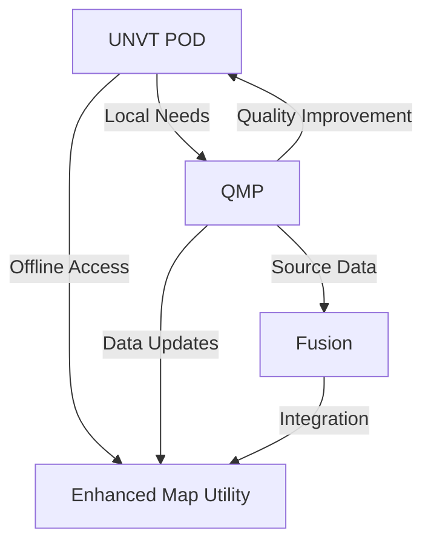

# [UNVT POD, QMP, and Fusion Initiatives](https://hfu.github.io/2025)

The Smart Maps Group of the UN Open GIS Initiative is spearheading the UNVT POD, QMP, and Fusion initiatives for the summer and winter of 2025. These projects aim to:

- **Enhance Map Usability**: UNVT POD will provide offline map access in resource-constrained environments.
- **Enable Rapid Map Improvements**: QMP will facilitate quick updates and enhancements to OpenStreetMap (OSM) data.
- **Integrate Diverse Data Sources**: Fusion will combine authoritative and community-driven vector tile data to meet diverse user needs.

Together, these initiatives will advance geospatial operations and promote open web mapping technologies for a better world.

We have created a collaborative [scratchpad](https://hackmd.io/@smartmaps/2025) on HackMD to facilitate brainstorming, documentation, and idea sharing for the 2025 initiatives. This scratchpad serves as a central hub for:

- **Project Updates**: Stay informed about the latest developments in UNVT POD, QMP, and Fusion.
- **Collaborative Editing**: Contribute to discussions, refine concepts, and share insights with team members.
- **Resource Sharing**: Access links, references, and technical resources relevant to the initiatives.
- **Feedback Collection**: Provide and review feedback to improve project outcomes.

Feel free to join the conversation and help shape the future of open geospatial technologies!

## UNVT POD: United Nations Vector Tile Toolkit Portable Option D

### Purpose of UNVT POD

UNVT POD aims to provide map access to users with limited resources, utilizing the latest cloud-native technologies in environments with unstable or unavailable internet connections.

### Technical Concept

UNVT POD is designed as a portable and self-contained system that can function offline. It will use the latest vector tile technology and is intended to be cost-effective to build and operate, supporting one to four users per unit.

### Key Features of UNVT POD

* Portable and self-contained system
* Usable in offline environments
* Based on the latest vector tile technology
* Low cost to build and operate
* Designed for small groups of users (1-4 per unit)

### Tools Used

The following tools will be used in the development of UNVT POD:

#### Geospatial

* [Tippecanoe](https://github.com/felt/tippecanoe): This tool will be used to build vector tilesets from GeoJSON, FlatGeobuf, or CSV data.
    * Reasoning: Tippecanoe is a proven, high-performance tool for efficient vector tile generation.
* [go-pmtiles](https://github.com/protomaps/go-pmtiles): This tool will be used for efficient processing of PMTiles data.
    * Reasoning: go-pmtiles provides high performance due to the efficiency of the Go programming language.

#### Web Frontend

* [MapLibre GL JS](https://maplibre.org/maplibre-gl-js/docs/): This JavaScript library will be used to display interactive maps in web browsers.
    * Reasoning: MapLibre GL JS offers high performance and flexibility for modern map representations. It is open-source, with an active community.

#### Web Backend

* [Martin](https://[github.com/maplibre/martin): This server will be used to serve vector tiles with high performance.
    * Reasoning: Martin is designed for high performance and scalability, making it suitable for cloud-native environments.
* [Caddy](https://caddyserver.com/): This web server will be used for its power, adaptability, and ease of use.
    * Reasoning: Caddy offers modern web server features, such as automatic HTTPS and simplified configuration, which helps to reduce operational costs.

#### System

* [Git](https://git-scm.com/): This distributed version control system will be used.
    * Reasoning: Git is essential for development version control, collaboration, and backups.
* [tmux](https://github.com/tmux/tmux): This terminal multiplexer will be used.
    * Reasoning: tmux helps to efficiently manage multiple terminal sessions, streamlining development and operations.
* [Pkl](https://pkl-lang.org/): This configuration language, which is programmable, scalable, and safe, will be used.
    * Reasoning: MapLibre style descriptions (in JSON) can be complex. Pkl will help manage this complexity.
* [jq](https://jqlang.org/): This lightweight and flexible command-line JSON processor will be used.
    * Reasoning: jq is a versatile and powerful tool for efficient processing of JSON data.

## QMP (Quick Mapping Project)

### Purpose of QMP

The Quick Mapping Project (QMP) aims to enable rapid responses to specific map enhancement needs using OpenStreetMap (OSM).

### Technical Concept

The proposed process for QMP is as follows:

1.  Requests to add or modify map data in a specific area will be registered on GitHub Issues.
2.  The tag #qmp will be added to the OSM changeset. The [Rapid](https://rapideditor.org/) editor may be used for mapping.

### Handling as OpenStreetMap Organized Editing

* QMP may be categorized as an OSM Organized Editing activity.
* Depending on the project's scope and impact, it might be necessary to coordinate with the OSM community beforehand.
* This project seeks to encourage broad participation while adhering to OSM community guidelines and establishing appropriate procedures as needed.

## Fusion: Integration of Vector Tile Data

### Purpose of Fusion

In addition to data from UNVT POD and QMP, Fusion aims to integrate vector tile data from various public organizations and projects. This will provide more comprehensive map information to meet diverse user needs.

### Technical Concept

* **Integration of Diverse Data Sources**: Fusion will utilize vector tile data from public organizations, such as the Geographical Survey Institute of Japan (GSI) and GISTDA (Thailand).
* **Flexible Data Selection on the Client-Side**: The system will allow users to freely combine necessary data layers based on their specific requirements.
* **Utilization of PMTiles**: PMTiles format will be used to efficiently distribute and utilize vector tile data from different sources.

### Key Features of Fusion 🔄

* **Rich Data Integration** 🌍
  - Combines multiple authoritative and community data sources
  - Creates comprehensive, up-to-date map information
  - Enhances data quality through diverse source integration

* **User-Centric Design** 👥
  - Customizable data layer selection
  - Flexible visualization options
  - Intuitive interface for data combination

* **Public-Private Collaboration** 🤝
  - Merges authoritative data from public organizations
  - Integrates community-driven OSM updates
  - Ensures data reliability and freshness

## Synergistic Effects 🚀

### 🔄 Integrated Workflow

1. **Data Flow Enhancement**
   - QMP updates feed into UNVT POD vector tiles
   - Fusion integrates multiple data sources
   - Seamless offline accessibility via UNVT POD

2. **Community-Driven Development**
   - Local needs inform QMP priorities
   - UNVT POD deployment guides mapping focus
   - Fusion adapts to regional requirements

3. **Flexible Implementation**
   - PMTiles format enables efficient data sharing
   - Client-side customization options
   - Scalable architecture for various use cases

### 📈 Impact Metrics
- Number of areas mapped through QMP
- UNVT POD deployment locations
- Data sources integrated via Fusion

